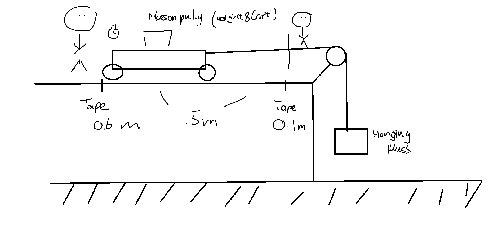

Purpose of the Lab
	- Newton’s Second Law Lab was to determine the relationship of mass, acceleration, and force on a Modified Atwood Machine. 

Materials
	- Cart
	- Cart Stopper (can be human or object) 
	- Hanging mass
	- Stopwatch (timer)
	- String
	- Table pulley
	- Meter Sticks

  

Procedure
	1.   Measure and mark the distance between 0.1m and 0.6m from the edge of the table using Meter Sticks to measure the displacement of cart
	2. Put the pulley on the edge of the table
	3. Attach a string to the cart, and attach the other end of the string on the hanging mass on the pulleys
	4. ( Part A )
		1. Decide on a system of constant mass, the system should be consistent to the two masses, on should be attached to the end of the hanging mass while the other is added with the cart's mass
		2. Hold the cart on the 0.6 meter mark; start the timer after you let go. 
		3. when the cart hits the 0.1 mark, stop the timer and record the time
	5. ( Part B )
		1. Decide on a constant mass on the string, which the cart's mass would be changing
		2. hold the cart on the 0.6 meter mark; start the timer after you let go.
		3.  when the cart hits the 0.1 mark, stop the timer and record the time
	6. The acceleration of the carts are determined by velocity final then using then using the equation (Δv/Δt) assuming both time initial and velocity initial is 0 

Diagram

  

Data Table

Part A  

| Mass on Cart (kg) | Mass on Weight (kg) | T1 (s) | T2 (s) | T3 (s) | T4 (s) | T Average (s) | Acceleration (m/s^2) | Net Force (N) |
| ----------------- | ------------------- | ------ | ------ | ------ | ------ | ------------- | -------------------- | ------------- |
| .2                | .8                  | .805   | .76    | .76    | .73    | .764          | .857                 | .857          |
| .4                | .6                  | .47    | .6     | .615   | .535   | .555          | 1.623                | 1.623         |
| .5                | .5                  | .515   | .495   | .45    | .48    | .485          | 2.126                | 2.126         |
| .6                | .4                  | .345   | .4     | .52    | .35    | .379          | 3.485                | 3.485         |
| .8                | .2                  | .31    | .35    | .42    | .31    | .348          | 4.141                | 4.141         | 

Part B

| Mass on Cart (kg) | Mass on Weight (kg) | T1 (s) | T2 (s) | T3 (s) | T4 (s) | T Average (s) | Acceleration (m/s^2) |
| ----------------- | ------------------- | ------ | ------ | ------ | ------ | ------------- | -------------------- |
| .2                | .2                  | 0.37   | 0.425  | 0.53   | 0.4    | 0.431         | 2.689                |
| .3                | .2                  | 0.53   | 0.535  | 0.585  | 0.48   | 0.533         | 1.763                |
| .4                | .2                  | 0.53   | 0.585  | 0.59   | 0.575  | 0.57          | 1.539                |
| .5                | .2                  | 0.63   | 0.7    | 0.635  | 0.695  | 0.665         | 1.131                |
| .6                | .2                  | 0.705  | 0.685  | 0.69   | 0.695  | 0.694         | 1.039                | 
  
  
Graph

Part A

Part B 
	**DO NOT COPY THIS SPECIFIC GRAPH**
	
Error Analysis 
	In this experiment, two major errors can happen during the experiment: Human error in the timing and the cart not being directly parallel to the pulley. This experiment requires the human to use their eyesight and reaction time to start and stop the timer at the exact time when the cart hits the stopping point. The difference between the human’s reaction time to the cart hitting the stopping point can result in major differences in timing across the team time final. The string that is tensioning between the weight and the cart isn’t always directly straight with each other, resulting in the cart moving in unexpected directions, causing the error.

Outside Application 
	We can use this experiment to help easily lower the weights of objects that are not easy to lift. These things can be present in construction cranes, construction equipment, and such. Modified Atwood Machines allows the user to require less energy to do a specific job. For example, lowering a crane at a massive height. These principles can help build gigantic architectural projects and help with many other engineering and mechanical projects.

Conclusions
	When finding the slope of the Acceleration vs. Fnet graph, we can observe a direct proportionality between net force (Fnet) and acceleration. The slope of the Acceleration vs. Fnet graph represents the 1/mass of the system. This is consistent with Newton's Second Law, which states that the acceleration of an object is directly proportional to the net force applied to it and inversely proportional to its mass. In the Acceleration vs. Mass graph, we see a clear inverse relationship between mass and acceleration, indicating that as mass increases, acceleration decreases. In the Acceleration vs. Mass graph, the slope represents the reciprocal of force (1/Fnet). Both of the graphs are consistent with Newton's Second Law.

**Check the lab rubric if all is correct** [Lab4-Rubric](Lab4-Rubric.pdf)
Here is a checklist [Lab Checklist](Lab%20Checklist.md)

